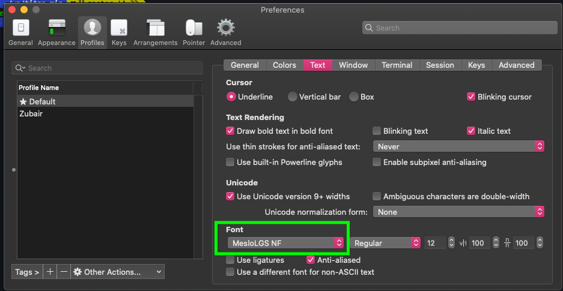

# iterm-zsh-setup
This is a guide to setup "Iterm" on OSX with oh-my-zsh.


# Installation guide for OSx

1. Install iterm2 (modern terminal emulator with additional features) by downloading from here : https://iterm2.com

2. Install zsh 

    ```bash
    brew install zsh
    ```

3. Install oh-my-zsh (a framework to manage zsh configuration, plugins and themes) :

    ```bash
    # using curl
    sh -c "$(curl -fsSL https://raw.githubusercontent.com/ohmyzsh/ohmyzsh/master/tools/install.sh)"


    # using wget
    sh -c "$(wget -O- https://raw.githubusercontent.com/ohmyzsh/ohmyzsh/master/tools/install.sh)"

    ```

4. Install zsh plugins

    zsh configuration by default is available under [~/.oh-my-zsh] folder. To install plugins you can clone the plugins repo directly inside
    [~/.oh-my-zsh/plugins] and themes can be cloned under [~/.oh-my-zsh/themes] folder.

    I recommend following plugins :

    1. git : create aliasis useful for git commands, more info here https://github.com/ohmyzsh/ohmyzsh/blob/master/plugins/git/git.plugin.zsh)

        ```bash
        # ~/.zsshrc
        plugins=(git)

        source ~/.zshrc
        ```

    2. docker: Docker based aliasis (creates docker based aliasis)

        ```bash
        # ~/.zsshrc
        plugins=(git docker)

        # for changes to reflect
        source ~/.zshrc
        ```

    3. zsh-autosuggestions: For autosuggestion of commands based on history.

        ```bash

        # ~/.oh-my-zsh/plugin/
        git clone  https://github.com/zsh-users/zsh-autosuggestions

        # ~/.zsshrc
        plugins=(git docker zsh-autosuggestions)

        # for changes to reflect
        source ~/.zshrc
        ```

    4. zsh-syntax-highlighting : For syntax highlighting.

        ```bash

        # ~/.oh-my-zsh/plugin/
        git clone https://github.com/zsh-users/zsh-syntax-highlighting.git

        # ~/.zsshrc
        plugins=(git docker zsh-autosuggestions zsh-syntax-highlighting)

        # for changes to reflect
        source ~/.zshrc
        ```

    5. Bonus : One of the disadvantaged of oh-my-zsh is having so many plugins with their own aliasis that it becomes difficult to manage. Therefore, I recommend additional plugin zsh-you-shoud-use which will tell you aliasis already available for the commands being used.

        ```bash
        # ~/.oh-my-zsh/plugin/
        git clone https://github.com/MichaelAquilina/zsh-you-should-use.git


        # ~/.zsshrc
        plugins=(git docker zsh-autosuggestions zsh-syntax-highlighting zsh-you-should-use)

        # for changes to reflect
        source ~/.zshrc
        ```
        
        Here is a collection of other many plugin you can install based on your use case: https://github.com/unixorn/awesome-zsh-plugins#plugins
        

5. Install fonts for iterm2

    Fonts are required to be installed on your mac before it can be used inside iterm2. I recommedn powerline fonts, which can be installed from here: https://github.com/powerline/fonts

    Once the fonts are installed, set the fonts in the iterm2 prefernces -> profile -> text tab (as shown in image below):

    

    Restart iterm for changes to take effect.

6. Install powerlevel10k (A zsh theme which emphasis on speed, flexibility and out-of-the-box experience). 

    Here is a snapshot of what powerlevel10k will make your terminal look like: 

    

    ```bash
    # ~/.oh-my-zsh/themes/
    git clone --depth=1 https://github.com/romkatv/powerlevel10k.git

    # ~/.zsshrc
    ZSH_THEME="powerlevel10k/powerlevel10k"

    # for changes to reflect
    source ~/.zshrc
    ```

### Boom you are done ! You have configured a whole new terminal emulator.

### Bonus : cmd + D -> Split iterm2 pane vertically
### Bonus : cmd + shift + D -> Split iterm2 pane horizontally


    


